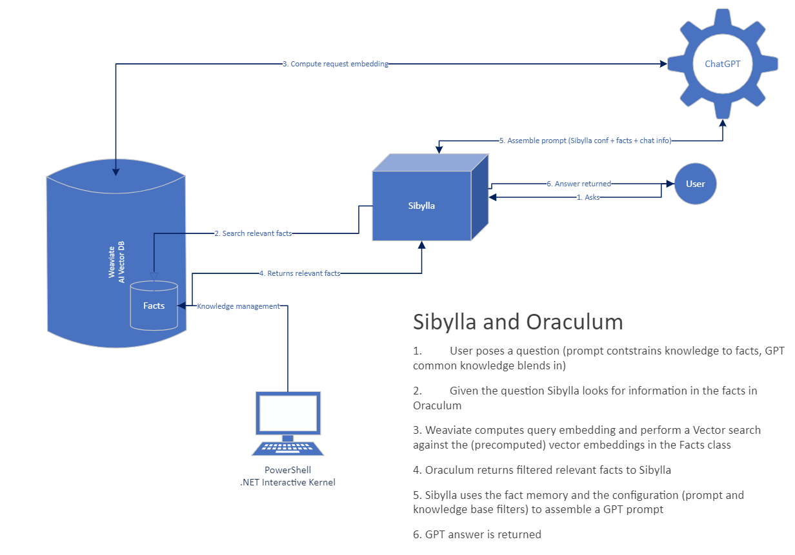

# Oraculum and Sibylla

**New:** Checkout `OraclumLocalBox` for a self-contained sandbox for trying the system.

The aim of this project is to create a lightweight and easy to deploy AI assistant dedicated to answer
to questions using a knowledge base expressed in facts. Relying on a vector database (Weaviate) the 
knowledge is "semantically" indexed using *embeddings* so that information expressed in a language can 
be queried using different languages.

Facts are small chunks of information with metadata (i.e. *category*, or a citation string) and are
selected for engineering a prompt by the chat assistant named *Sibylla* for answering question about
topics in the knowledge base. It is possible to have multiple Sibyllae accessing the *Oraculum* knowledge
base whose behavior is affected by the specific prompt used to configure each of them.

Knowledge is added to the system using a set of PowerShell cmdlets that can be used to spider and
preprocess information from different sources (i.e. web pages, documents, etc.) and then add them to
the knowledge base. To monitor the evolution of the knowledge and the behavior of the Sibyllae the project
also includes a .NET Interactive notebook that can be used to inspect the knowledge base and instantiate
multiple Sibyllae for testing.

## Why another one?
When I started developing this project the main reasons were:

- Easy integration with existing software
- Easy to deploy and understand (small codebase)
- Avoid intricacies of a generalized architecture when many of the tools used are still in their infancy and models not yet consolidated
- Focus on tools for knowledge management, not on AI assistant

The project it's still in his infancy but it can be used in production if you want to quickly start with AI in your systems.

## What's new

### Version 1.1.2
- Added `UpdateFact` to support fact update (in particular from CLI)

### Version 1.1.1
- Added support for Azure OpenAI version of GPT. The Oraculum configuration has been updated to include also Azure OpenAI parameters.

### Version 1.1.0
- Completely rewritten memory for Sibylla
- Introduced support to avoid persistance of unrelated messages into prompt
- Added `ILogger` support
- Changed Weaviate schema
- The upgrade procedure should be automatic though I suggest a `Get-Facts | ConvertTo-Json > backup.json` before upgrading.

### Version 1.0.2
- Exposed `Configuration` property in `Sibylla` class
- Added `Title` property to `SibyllaConf`

## What you need to start
In the jungle of models, companies, and tools of nowadays AI I decided for a set of tools, the overall system can be reasonably adapted to other tools but if you want to use it you need:

- An instance of Weaviate vector DB (either on-prem or in the cloud)
- An OpenAI subscription (both embeddings and chat are implemented using OpenAI technologies)

This project relies on [WeaviateNET](https://github.com/Unipisa/WeaviateNET) to access and use Weaviate vector DB.

You can tweak the *docker-compose.yml* file included in the project to deploy a self-contained sandbox for trying.

## Tools and management
The core project is very small (less than 1k loc), and it is packaged as .NET library so that you can easily embed it inside any .NET project. A Web API is also on the roadmap so that also Web-based integration scenarios will be supported.

An important aspect considered in the design is CLI support: we firmly believe that knowledge management is essential and command line is a precious tool when you need to get knowledge from most disparate sources. For this reason we created a set of powershell cmdlets that you can run on any platform for inspecting the fact database and edit it using your favorite set of tools for spidering and preprocessing.

## Getting started
The easiest way is to allocate a Weaviate instance on [Weaviate](https://weaviate.io) or to start a docker image if you have on-prem infrastructure. You can then install PowerShell core (7.3.0 or later) and then simply use the Oraculum powershell module from PowerShell gallery:

  Install-Module Oraculum

During the first run you need to create the *Oraculum* configuration file (if you use an unauthenticated version of Weaviate you can omit the ApiKey and also the OrgID in the OpenAI API is not rally used):

    $c = New-Object OraculumCLI.OraculumConfiguration
    $c.OpenAIApiKey = 'Your key'
    $c.OpenAIOrgId = 'Your org id'
    $c.WeaviateApiKey = 'Your weaviate api key'
    $c.WeaviateEndpoint = 'http://localhost:8080/v1'
    ConvertTo-Json $c > myoraculum.conf

Now you can initialize the schema and start loading your knowledge:

    Connect-Oraculum -ConfigFile myoraculum.conf
    Reset-Schema
    Add-Fact -Category FAQ -Title "My first FAQ" -Content "Content of my FAQ"
    ...
    Get-Facts | Out-GridView

The *Get-Facts* cmdlet allows you to inspect the Fact class, you can use filters to select only facts with some meta-attributes.

You can configure an instance of *Sibylla* in a similar way:

    $c = New-SibyllaConf -SystemPrompt "You are an operator who answers questions from users of the X system. You will only respond to questions regarding missions on behalf of the Organization. For all other questions, you will reply with 'I am authorized to respond only to X-related matters.' To answer, you will use only true facts and information related to the facts in XML format that will follow in place of your knowledge. Facts with the 'faq' element address frequently asked questions, and facts with the 'reg' element pertain to regulation clauses. If you use information from an XML fact that has a 'cit' attribute, include the citation in parentheses in your response. Each question you receive will be from a user with an issue." -AssistantPrompt "Welcome to X support" -Model gpt-3.5-turbo -MaxTokens 256 -Temperature 0.1
    ConvertTo-Json $c > mysibylla.conf

Now you can start a Sibylla session:

    New-SibyllaSession -ConfigFile mysibylla.conf

**Important**: The prompt of a Sibylla is up to you but the system will inject relevant facts from the Weaviate DB in XML format so you should always mention this in your prompt.

## Implementation status
This is the first public release of the project, the strategy by which Sibylla adds facts to the prompt is still in its infancy and it will be needed more research and testing to find a policy respectful of the prompt size that still retain the important domain knowledge.

